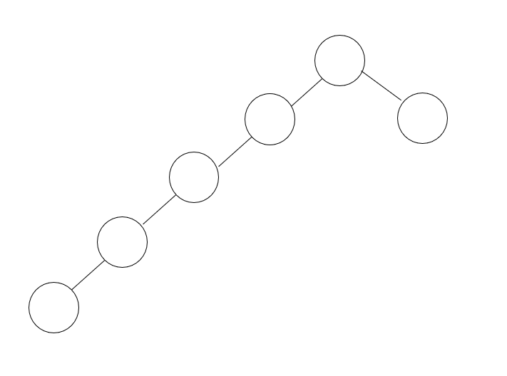

# 이진 탐색 트리

이진 탐색 트리 (Binary Search Tree)는 '이진 탐색'을 위한 트리이자, 탐색을 위한
'이진 트리'입니다. 다시 말해 이진 탐색 트리는 '이진 탐색'을 위한 '이진 트리'이다.

`이진 탐색 알고리즘이 있는데 왜 이진 탐색 트리가 필요한 것일까?`

이진 탐색은 데이터 집합이 배열인 경우에만 사용할 수 있기 때문이다.
이진 탐색을 하기 위해서는 데이터 집합의 처음과 끝을 알아야하고, 순식간에 데이터 집합의
중앙 요소를 계산할 수 있어야 하며, 계산된 중앙 요소에 즉시 접근이 가능해야한다.

링크트 리스트는 이진 탐색에 필요한 이러한 작업들이 불가능한 자료구조이다.
처음과 끝 (헤드 와 테일)의 위치는 알 수 있어도, 헤드와 테일 사이의 중앙 요소는 알 수 없기 때문이다.
다시 말해 이진 탐색은 사전에 정의된 크기의 데이터 집합에 대해서만 사용이 가능하고, 동적으로 
그 크기가 달라지는 데이터 집합에는 적용이 불가능하다.

이 딜레마를 해결해주는 자료구조가 이진 탐색 트리이다. 

### 뒤늦게 생각해보는 이진 탐색 트리의 문제점

이진 탐색 트리는 정말 훌륭한 알고리즘입니다. 동적을 그 크기가 증가하는 데이터 집합에
대해서도 잘 대처하며, 탐색 속도도 나무랄 데 없이 훌륭해 보입니다. 
하지만 이진 탐색 트리에는 문제가 있습니다. 
바로 다음 그림 처럼 이진 탐색 트리가 기형적으로 성장해서 검색의 효율을 극단적으로 떨어뜨리는 것입니다. 

이 문제를 해결할 수 있는 것이 레드 블랙 트리이다.

