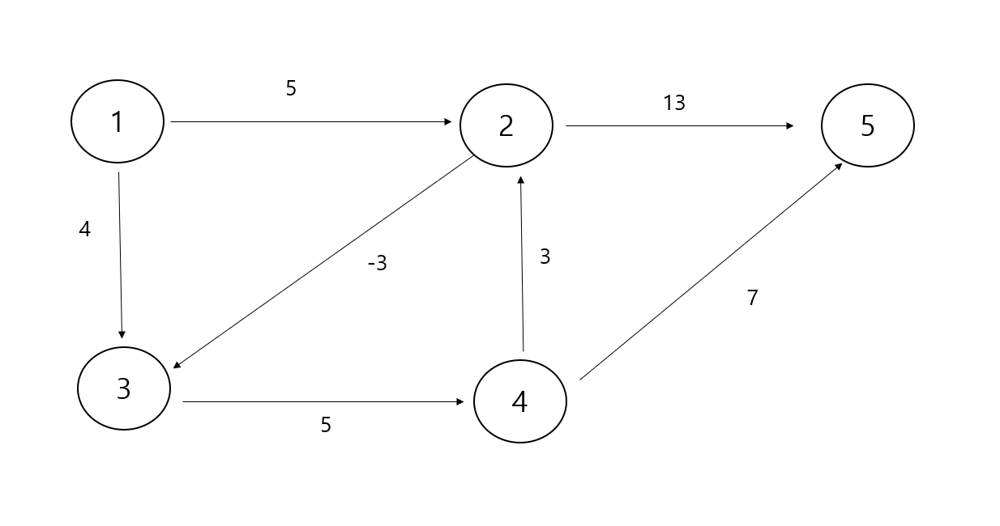

# 벨만-포드 알고리즘

N개의 도시가 주어지고, 각 도시들을 연결하는 도로와 해당 도로를 통행하는 비용이 주어질 때
한 도시에서 다른 도시로 이동하는데 쓰이는 비용의 최소값을 구하는 프로그램을 작성하세요

## 입력 설명

첫 번째 줄에는 도시의 수 (N<=100)과 도로수 M(M<=200)가 주어지고, M줄에 걸쳐 도로정보와
비용이 주어진다. 만약 1번 도시와 2번 도시가 연결되고 그 비용이 13이면 "1 2 13"으로 주어진다.

그 다음 마지막 줄에 출발도시와 도착도시가 주어진다.

## 출력 설명

출발도시에서 도착도시까지 가는데 걸리는 최소 비용과 경로를 출력한다. 음의 사이클이 존재할 경우
-1를 출력한다.

